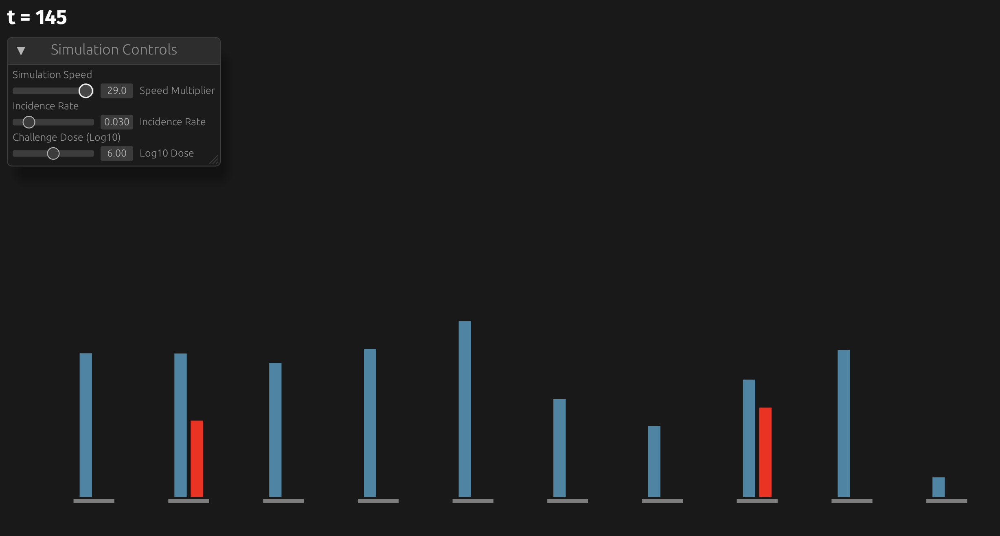
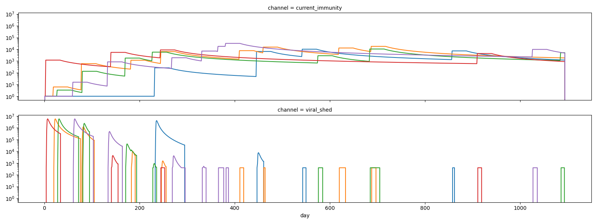
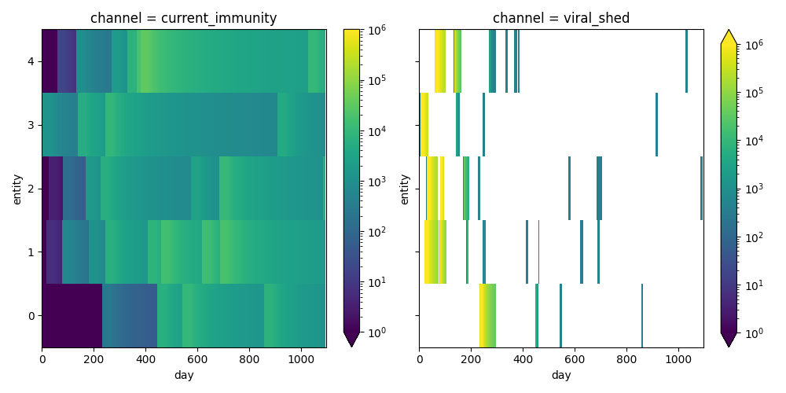

[](https://codespaces.new/edwenger/pybevy-polio)

A demonstration project to experiment with a few different concepts:
- porting polio within-host logic into Rust for use with [Bevy](https://bevy.org/) gaming engine (related to previous Python code implementations in [StarSim](https://github.com/edwenger/starsim-bokeh-demo/blob/main/polio.py), [poliosim](https://github.com/amath-idm/poliosim), and [multiscale](https://github.com/InstituteforDiseaseModeling/MultiscaleModeling/blob/main/PopSim/Assets/Infection.py) models)
- experimenting with interactive visualizations for debugging and building intuition about model logic behavior (related to similar effort on [malaria coinfection](https://github.com/edwenger/bevy_coinfection_demo/tree/main))
- exporting Rust functions and modules to Python package with [PyO3](https://pyo3.rs/) and [maturin](https://www.maturin.rs/tutorial.html) (for further integration in tutorial notebooks, calibration workflows, etc.)

## Quick Start

### Option 1: GitHub Codespaces (Recommended)
Click the "Open in GitHub Codespaces" badge above for pre-configured development environment.
- see [setup.sh](.devcontainer/setup.sh) for details
- see [demo.ipynb](demo.ipynb) for a demo notebook using the exported python package

### Option 2: Local Development
To launch the interactive demo yourself, run the following from the commandline:
```cd app && cargo run```

You'll have to have `rustup` installed already.  Instructions [here](https://www.rust-lang.org/learn/get-started).



## Web Application (WASM)
To run the simulation in your web browser:
```bash
cd app && trunk serve --open
```
Visit `http://localhost:8080` for the same interactive visualization with real-time parameter controls. Requires [trunk](https://trunkrs.dev/) for WASM deployment (install with `cargo install trunk`).

## Python Package Development

### In Codespaces
Everything is automatically set up! Just run:
```bash
python pybevy/test.py
```

### Local Setup
To build the exported Python package, run maturin from within a new venv:

```bash
python -m venv .venv
source .venv/bin/activate
maturin develop --release  # Rebuild pybevy
```

To test if the exported `pybevy` python library is accessible, you can run:
```python pybevy/test.py```

Or also by launching and re-running the code in demo notebook:
```jupyter notebook demo.ipynb```

And look at time-series outputs for different longitudinal challenge scenarios like below:




To enable info-level logging, one can set environment variable like this:
```
RUST_LOG=info cargo run
```
or 
```
RUST_LOG=info python test.py
```
